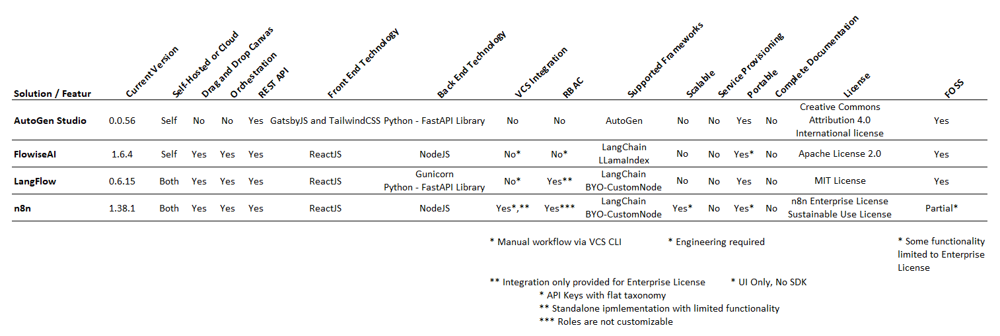

# Overview
This directory contains a review and comparison of several AI Studios on the market. An AI Studio is the AI analogue of a traditional IDE used to develop non-AI applications. It allows AI engineers to build end-to-end solutions using low or no-code methods. Additionally, as many AI solutions rely on orchestrated workflows, many AI Studios offer orchestration features and capabilities; such as the ability to define a workflow or execute a workflow.

Below we will review the key features and various open source products on the market.

# Criteria for Comparison
The various offerings were compared against the following criteria:

- **Current Version** - The version of software being evaluated
- **Self-Hosted or Cloud** - An indication of whether the solution can be self-hosted or is a provided as a cloud based service
- **Drag and Drop Canvas** - An indication of the type of UI that is provided for defining AI workflows
- **Orchestration Capabilities** - An indication of whether the tool allows workflows to be defined and executed
- **REST API** - An indication of whether or not the solution has a REST API
- **Front End Technology** - A description of the technologies used to build the UI
- **Back End Technology** - A description of the technologies used to build the API and backend services
- **VCS Integration** - An indication of whether or not VCS tooling (like git) can be integrated into the system or the user workflow
- **RBAC** - An indication of whether Role Based Access Control (RBAC) features are provided
- **Supported Frameworks** - A list of supported AI frameworks
- **Scalable** - An indication of whether or not the solution can be scaled
- **Service Provisioning** - An indication of whether or not the solution will provision services consumed by the orchestrated workflows
- **Portable** - An indication of how easy the solution can be imported/exported from the tool and run without the AI studio
- **Complete Documentation** - An indication of whether or not the documentation is completed and helpful
- **License** - A list of applicable software licenses
- **FOSS** - An indication of whether the software is free and open source

# Products Compared
- [AutoGen Studio](AutoGen%20Studio.ipynb)
- [FlowiseAI](FlowiseAI.ipynb)
- [LangFlow](LangFlow.ipynb)
- [n8n](n8n.ipynb)

**Note**: I wanted to review superagent but I believe it has a bug. I have opened a github issue and will add it to the comparison spreadsheet once I have been able to evaluate it.

# Comparison Results

# Reccomendations

Based on my experiences with the tools I would reccomend using LangFlow. I think it offers the best feature set and most portability. 

If FlowiseAI is able to match the portability and closes the open feature request I would also reccomend that tool as it also supports LlamaIndex natively.

The AutoGen Studio licensing is a red flag in my humble opinion and the n8n solution has no plans to offer an SDK which is also concerning.

# Closed Source Products (Not Reviewed)
- SmythOS
- Google AI Studio

# Related Products
LM Studio - Lets you design and build OpenAI compatible APIs around self-hosted LLMs.
Text Generation Web UI - An web based application providing the ability to interact with an LLM or Model API.

# Current Offerings