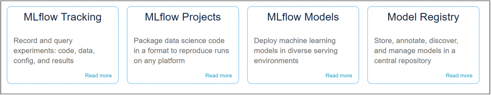

# Overview

According to the [homepage](https://mlflow.org/) MLFlow is "An open source platform for the machine learning lifecycle". Its intended purpose is to provide a single tool which allows data scientists to address ML specific components of the Software Development Life cycle (SDLC) including: experimentation, reproducibility, model deployment, and a model storage in a centralizing model registry.

The project breaks down into four sub-components:

- MLflow Tracking - Allows user to record and query experiments: code, data, config, and results
- MLflow Projects - A standard package format allowing reproducable deployments of models to any platform regardless of where they were authored
- MLflow Models - A unified abstraction layer allowing support for integration with multiple machine learning model libraries and providers
- Model Registry - Store, annotate, discover, and manage models in a central repository

We will see that each sub-component has a coresponding UI and API. The documentation is a bet confusing but we wil see that all these components are tightly integrated and presented as a single service.

The project page boasts integrations with many big name players, providers, and technology stacks and sees contributions coming from many big names in the space.

# 1. MLFLow Object Model

An **MLFlow Model** is an abstraction layer provided to unify the handling and packaging of machine learning models. This abstraction layer allows MLFlow to handle multiple types of models from multiple providers and technology stacks without concern. As we saw in the [MLFlow Tracking API Notebook](MLFLlow%20Tracking%20API.ipynb) we have the ability to experiment and log results to the Tracking API. An MLFlow model is thus created when we call the *log_model()* function. In additional to providing a generic interface for various model types, the MLFlow Model also provides a standard [packaging (storage) format](https://mlflow.org/docs/latest/models.html). The packaging format is a directory. Each MLflow Model is a directory containing arbitrary files. There are several standard files that appear in this directory including the MLmodel file (a yaml file defining the flavors the model supports), a model.pkl (a pickel file containing a serialized version of the model), and a conda.yaml file (a yaml file defining the dependencies for the conda environment to host the model). We will see that different files are included for different flavors.

MLFlow **Model Flavor** is an abstraction layer which that attaches standardized metadata to a specific Model. The flavor basically defines a standard method for running a model. Each registered model can come in multiple flavors; meaning that there are a number of different ways we can run the model. The flavor is useful because the metadata allows deployment mechanisms to understand what the model is and how to deploy (run) it. It makes the integrations more efficient because deployment tooling no longer need to be tightly coupled with the underlying model implimentations; we do not need to write a new integration for each model type. For example, there is an "sklearn" flavor which runs a model as an sklearn pipeline and there is a "python function" flavor which allows a model to be run a simple parameterized python function. There are flavors for Apache Spark, AWS SageMaker, and other deployment mechanisms.

An **MLflow Model** is created from an experiment or run that is logged with one of the model flavor’s mlflow.<model_flavor>.log_model() methods. An MLflow Model is a standard format for packaging machine learning models that can be used in a variety of downstream tools—for example, real-time serving through a REST API or batch inference on Apache Spark. The format defines a convention that lets you save a model in different “flavors” that can be understood by different downstream tools.

Any MLFlow Model that is logged to the Tracking API can be registerred to the Registry API. A **Registered Model** is identified by a unique name. Registered models allow us to track the lineage of a model using version numbers. Registered models also allow us to manage the model through the defined lifecycle stages.

MLFlow provides **Model Versions** as a way to track changes and lineage between iterations of a registered model. When a new model is registered to the MLFlow server it is given a default version number of 1. The MLFlow model version number is intended to document the evolution of the registered model over time as well as keep track of which model is deployed where. The version number of the registered model will be automatically increment when we register a new model version to the same model endpoint.

To facilitate model lifecycle management, MLFLow provides **Model Stages**. The model stages are logical constructuct representing different milestones along the lifecycle. MLflow provides predefined stages for common use-cases such as Staging, Production or Archived. You can transition a model version from one stage to another stage. Each distinct model version can be assigned one stage at any given time. We will see that these model stages provide an anchor point for controlled model deployments. This allows developers to deploy new versions of a model into a Development stage, without impacting the model in Production.

# 2. MLFlow Architecture

Before we get started with MLFlow, It is important to understand the architectural components. As we will see in section 2, there are a number of ways to deploy the MLFlow. Before we choose a method, it is important to understand that an MLFlow deployment consists of the following components:
- Backend - Persists MLflow entities (runs, parameters, metrics, tags, notes, metadata, etc)
- Artifact Store - persists artifacts (files, models, images, in-memory objects, or model summary, etc)
- REST API - The optional component exposing web based MLFlow API
- Tracking UI - The Web UI for lets you visualize, search and compare runs, as well as download run artifacts or metadata for analysis in other tools, and register or tag models.

# 3. Deployment Options

Reading through the [documentation](https://mlflow.org/docs/latest/tracking.html), assuming you are deploying your own MLFlow installation, you have the following documented options:

<table >
	<tbody>
		<tr>
			<td>Scenario</td>
			<td>Description</td>
			<td>Backend</td>
			<td>Artifact Store</td>
		</tr>
		<tr>
			<td>1</td>
			<td>MLflow on localhost</td>
			<td>local ./mlruns&nbsp;directory</td>
			<td>local ./mlruns&nbsp;directory</td>
		</tr>
		<tr>
			<td>2</td>
			<td>MLflow on localhost with SQLite</td>
			<td>local ./mlruns directory</td>
			<td>local mlruns.db file</td>
		</tr>
		<tr>
			<td>3</td>
			<td>MLflow on localhost with Tracking Server</td>
			<td>A REST API utilizes&nbsp;./mlruns directory</td>
			<td>A REST API utilizes ./mlruns directory</td>
		</tr>
		<tr>
			<td>4</td>
			<td>MLflow with remote Tracking Server, backend and artifact stores</td>
			<td>A REST API utilizes remote backend</td>
			<td>A REST API utilizes remote artifact store</td>
		</tr>
	</tbody>
</table>

**Note**: None of these options discuss the MLFlow UI. It is deployed using the command line as we will see in our notebooks.

Databricks and AWS also provide MLFlow deployments that data scientists can leverage.

For our purposes, we will keep it simple and go with scenario 1 and host our own UI.