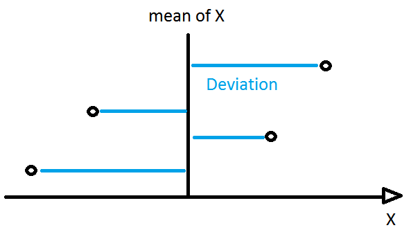
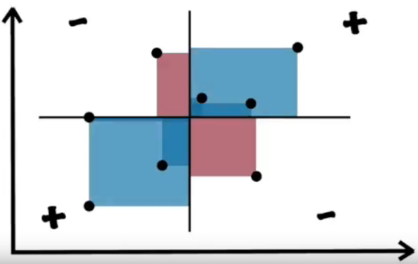
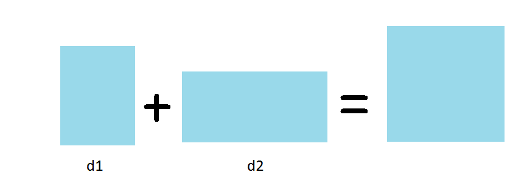
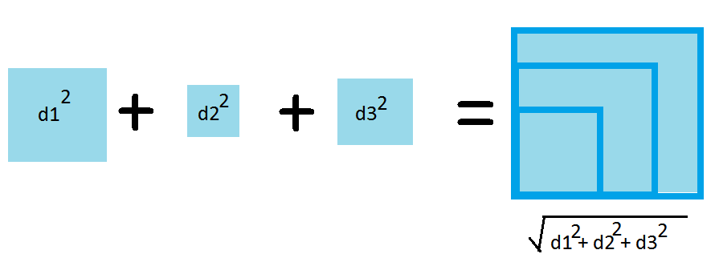

# Overview

In this notebook we review the concepts related to variance including:
- deviation
- variance
- covariance

# 1. Deviation
Deviation is a measurement of the distance between a variable and the central measurement (typically the mean) of a distribution. 

As we will see, deviation is a foundational measurement used in a wide range of descriptive statistics. For example the standard deviation is based on the concept of deviation. Deviation is loosly interpreted as a measurement for how normal or irregular a particular value is when compared to the distribution. There are a number of different measruements for deviation. 

The simplest formula is given as:

$$ d = x - \mu $$

A positive value indicates a particular value $x \in X$ is larger than $\mu$ and a negative indicating the opposite.

# 2. Variance
The variance gives a descriptive statistic that explains the "spread" of our data. It attemps to describe how spread out the data is.

It is expressed as an expected value and its core measruement is based on the square of a deviation from the mean. This allows it to plug into probability/likelihood frameworks. It also "penalizes" larger deviations due to the squaring; ie. the variance for a given deviation will be disproportionately larger for a large value than a small one. The formula is given as:

$$ Var(X)= \sigma^2 = \mathbb{E} \left[ (X-\mu )^{2} \right] $$

A another common representation of the formula can be derived as follows:

$$ = \mathbb{E} \left[( X - \mathbb{E}[X])^2  \right] $$

$$ = \mathbb{E} \left[ X^2 - 2X\mathbb{E}[X] + \mathbb{E}[X]^2  \right] $$

$$ = \mathbb{E}[X^2] - 2\mathbb{E}[X]\mathbb{E}[X] + \mathbb{E}[X]^2 $$

$$ = \mathbb{E}[X^2] - 2\mathbb{E}[X]^2 + \mathbb{E}[X]^2 $$

$$ = \mathbb{E}[X^2] - E[X]^2$$

We will see that variance can be expressed in a univariate case as well as a multivariate case.

## 2.1. Univariate Case
### 2.1.1. Univariate non-matrix algebra
The simplest definition of variance is defined for a single dimension as follows

$$ \sigma_{X_i} = \mathbb{E} \left[ (X_i-\mu_{X_i} )^{2} \right] = \frac{1}{n}\sum^n_i (x_i-\mu_{X_i} )^{2} $$

Where $x_i \in X$

This equation is derived by expanding the Expectation operator $\mathbb{E}$ for a discrete random variable we would have:

$$ \mathbb{E}[X] = \sum \left( p_X * x_i \right) $$

If we assume a uniform random variable, with $p=\frac{1}{n}$, we derive:

$$ \mathbb{E}[X] = \frac{1}{n}\sum x_i $$

### 2.1.2 Univariate matrix algebra

$$ \sigma_{X_i} = \frac{1}{n}(X_i - \mu_{X_i})^T (X_i - \mu_{X_i}) $$

## 2.2. Multivariate Case

When we have multiple variables, we need to complete many operations to calculate the variance for each var. We can optionally then look at the covariance which in turn has its own calculations. With matrices this becomes a lot easier and can be done in a single operation as we will see.

### 2.2.1. Univariate non-matrix algebra

For each variable pair we would compute:

$$ \sigma_{X_i, X_j} = \mathbb{E} \left[ (X_i-\mu_{X_i} )(X_j-\mu_{X_j} ) \right] = \frac{1}{n}\sum^n_k (x_{i_k}-\mu_{X_i} )(x_{j_k}-\mu_{X_j} ) $$

If we compute the covariance between a variable and itself (ie. $X_i = X_j$) then $\sigma_{X_i, X_i} = \sigma_{X_i}$

### 2.2.2 Univariate matrix algebra

$$ \sigma_{X_i,X_j} = \frac{1}{n}(X_i - \mu_{X_i})^T (X_j - \mu_{X_j}) $$

We can expand this out to look at the results:

$$
=
\frac{1}{n}
\begin{pmatrix}
x_{i_1} - \mu_{X_i} &
x_{i_2} - \mu_{X_i} &
\vdots &
x_{i_n} - \mu_{X_i}
\end{pmatrix}
\begin{pmatrix}
x_{j_1} - \mu_{X_j} \\
x_{j_2} - \mu_{X_j} \\
\cdots \\
x_{j_n} - \mu_{X_j}
\end{pmatrix}
$$

$$
=
\frac{1}{n}
\begin{pmatrix}
(x_{i_1} - \mu_{X_i})(x_{j_1} - \mu_{X_j}) +
(x_{i_2} - \mu_{X_i})(x_{j_2} - \mu_{X_j}) +
\cdots +
(x_{i_n} - \mu_{X_i})(x_{j_n} - \mu_{X_j})
\end{pmatrix}
$$

### 2.2.3. Multivariate matrix algebra

Matrices provide us a way of calculating the variances/covariances for all variable paris all at once. We can define a matrix to hold our means as follows:

$$
\mu = 
\begin{pmatrix}
\mu_1 \\
\mu_2 \\
\vdots \\
\mu_n
\end{pmatrix}
$$

Where $\mu_i$ corresponds to $X_i$ for all $i$.

$$ \Sigma = \frac{1}{n}(X - \mu) (X - \mu)^T $$

We can expand this as:

$$
=
\frac{1}{n}
\begin{pmatrix}
X_{1} - \mu_{1} \\
X_{2} - \mu_{2} \\
\vdots \\
X_{n} - \mu_{n}
\end{pmatrix}
\begin{pmatrix}
X_{1} - \mu_1 &
X_{2} - \mu_2 &
\cdots &
X_{n} - \mu_{n}
\end{pmatrix}
$$

$$
=
\frac{1}{n}
\begin{pmatrix}
(X_1 - \mu_1)^2            & (X_1 - \mu_1)(X_2 - \mu_2) & \cdots & (X_1 - \mu_1)(X_n - \mu_n) \\
(X_2 - \mu_2)(X_1 - \mu_1) & (X_2 - \mu_2)^2            & \cdots & (X_2 - \mu_2)(X_n - \mu_n) \\
\vdots                     & \vdots                     & \ddots & \vdots  \\
(X_n - \mu_n)(X_1 - \mu_1) & (X_n - \mu_n)(X_2 - \mu_2) & \cdots & (X_n - \mu_n)^2
\end{pmatrix}
$$

$$
=
\begin{pmatrix}
\sigma_{X_1}      & \sigma_{X_1, X_2}          & \cdots & \sigma_{X_1, X_n} \\
\sigma_{X_1, X_2} & \sigma_{X_2}^2             & \cdots & \sigma_{X_2, X_n} \\
\vdots            & \vdots                     & \ddots & \vdots  \\
\sigma_{X_n, X_1} & \sigma_{X_n, X_2}          & \cdots & \sigma_{X_n}^2
\end{pmatrix}
$$

You will notice that the variances appear alongthe diagonal while the covariances appear in the non diagonals.

# 3. Covariance
Covariance is an attempt to explain variance in two dimensions or for two variables. Given two variables X and Y, the covariance multiplies the deviation of X by the deviation of Y. In a two dimentional space this would resemble the following:

Here, the horizontal and vertical line represent the means respective to the X and Y variables.

The geometric implications here are an important caveat to consider. A square is going to have the largest area of any rectangle with the same parimiter. As such, if the co-variables have the exact same deviations, the covariance value will form a square and thus be the largest possible value. If one variable is deviating while another is not, the area will be very small.

The formal definition is given as:

$$ Cov(X,Y) = \sigma_{X,Y} := \mathbb{E}[(X-\mu_X)(Y-\mu_Y)] $$

$$ = \mathbb{E} [ XY - X \mathbb{E}[Y] - \mathbb{E}[X][Y] + \mathbb{E}[X]\mathbb{E}[Y] ] $$

$$ = \mathbb{E}[XY] - \mathbb{E}[X]\mathbb{E}[Y] - \mathbb{E}[X]\mathbb{E}[Y] + \mathbb{E}[X]\mathbb{E}[Y] $$

$$ = \mathbb{E}[XY] - \mathbb{E}[X]\mathbb{E}[Y] $$

## 3.1. Univariate Case

If we expand the Expectation operator $\mathbb{E}$ for a discrete random uniform random variable, with $p=\frac{1}{n}$, we would have:

$$ Cov(X,Y) = \sigma_{X,Y} := \frac{1}{n}\sum(x_i-\mu_X)(y_i - \mu_Y) $$

## 3.2. Multiavariate Matrix Algebra

Matrix algebra allows us to calculate all the covariances between a set of variables simulatneously:

$$ \Sigma = \frac{1}{n} (X - \mu_X)(X - \mu_X)^T $$

# 4. Correlation
## 4.1. Types of Correlation

There are several types of correlations
- Pearson Correlation
- Kendal Rank Correlation
- Spearman Correlation
- Point-Biserial Correlation

https://www.statisticssolutions.com/correlation-pearson-kendall-spearman/

## 4.2. Pearson Correlation
### 4.2.1. Overview
The pearson correlation coefficient is the mode widely used statistical measure. It assumes a linear relationship bweteen two variables and measures the strength and direction of that relationship.

### 4.2.2. Definition

The correlation coefficient is expressed through the following formula:

$$ Cor(X,Y) = \frac{Cov(X,Y)}{Std. \ Dev(X) \ Std. \ Dev(Y)}  $$

$$ \rho = \frac{\sigma_{X,Y}}{\sigma_X \sigma_Y} $$

It is common to see this expanded for a uniform discrete variable:

$$ =\frac{\frac{1}{n}\sum{(x_i - \mu_X)(y_i-\mu_Y)}}{\sqrt{\frac{1}{n}\sum{}(x_i-\mu_X)^2}\sqrt{\frac{1}{n}\sum{(y_i-\mu_Y)^2}}} $$

If we simlify the formula by calcelling out the $1/n$ (ie. removing the probability consideration) we would have something like

$$ =\frac{\sum{(x_i - \mu_X)\sum(y_i-\mu_Y)}}{\sqrt{\sum{(x_i-\mu_X)^2}}\sqrt{\sum{(y_i-\mu_Y)^2}}} $$

$$  =\frac{\sum{(x_i - \mu_X)(y_i-\mu_Y)}}{\sqrt{\sum{(x_i-\mu_X)^2(y_i-\mu_Y)^2}}} $$

$$ =\frac{\sum d_xd_Y}{\sqrt{\sum d_x^2}\sqrt{\sum d_y^2}} $$

From this simplified equation we see the formula is expressed as a fraction of deviations. We have the co-deviation divided by the total deviation

### 4.2.3. Intuition and Interpretation

I think its helpful to consider correlation as a fraction of deviation measurements.

In order to understand the correlation coefficient we need to understand that it is a fraction or a proportion of deviations. 

Thinking about this geometrically helps explain the concept. 
If we think about deviation in one dimension we would have the following:

If we think about the problem in two dimensions we would have the following:
    

Referring back to the equation, when we look at the numerator

$$\sum d_x d_y$$

We can rearange the product of two deviations as a single term (ie. $d_{x_1}*d_{y_1} = d_1$). This can be interpreted as a rectangle representing the deviation caused by the two variables. We can think about the sum of the rectangles as follows:

Now if we consider the denominator of the equation

$$\sqrt{\sum d_x^2}\sqrt{\sum d_y^2}$$

It can also be interpreted as an area. This area is intended to represent the maximum possible total deviations of both x and y.

To understand this point, consider the geometric implications. An important characteristic of the square is that it has the largest area of any rectangle. This means that the squaring of the deviations represent the largest possible area representing the two dimensional deviation. Taking the quare root of this square gives us the optimal length of an arbitrary side.

Thus the denominator is again representing the maximum possible total deviation from both variables.

So the correclation coefficient is essentially a fraction of covariance to total possible variance!

### 4.2.4. Additional Notes

An interesting caveat in this calculation is the way that we determine the total deviation for a specific variable. We are using the squaring technique to find the absolute values rather than using the absolute value function. There are other correlation measurements which instead use the absolute value.